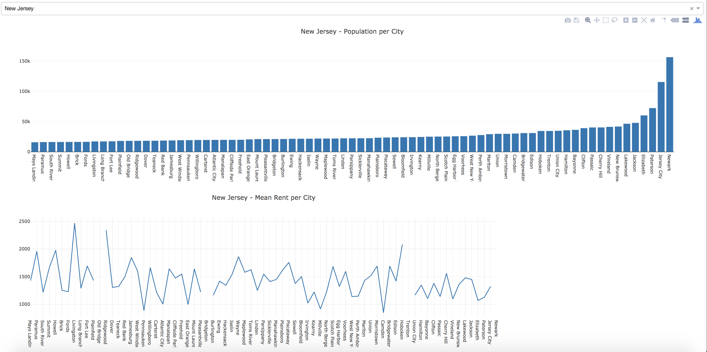

# Dash Altogether Now

## Introduction
In this lab we will be using our skills from flask, dash, pandas, and sqlalchemy to create a dashboard that contains graphs that we can manipulate to show data based on our input. We will be working with a very large dataset containing information on rent and population demographics in the US. We will be using the ETL pattern to create extract, format (or transform), and enter (or load) our data into our database. Let's get started!

## Objectives
* Create a package directory with an `__init__.py` and instantiate a new Dash App
* Set up database, connect Sqlalchemy and create models
* Use pandas to read the excel file and extract data
* Use ETL Pattern -- to format and load information over to database
* Create a layout that uses callback functions to populate bar graphs given a state's name as an input

## Setting Up a New Dash App

First things first. We will need to structure our app and get just our baseline dash app running. We already have our package directory with the name of our app (lesson), `dashaltogethernow`. We also already have our excel file with the data we will be working with, `real_estate_db.xlsx`. Our package should have an `__init__.py` file that imports dash and instantiates a new app with a `url_base_pathname` of `'/dashboard'`. Next, we will need to create our run file in our top-level directory which starts the server for us with debug mode assigned to True.

Your directory should look something like this:
```python
├── CONTRIBUTING.md
├── LICENSE.md
├── README.md
├── dashaltogethernow
│   ├── __init__.py
│   ├── real_estate_db.xlsx
├── index.ipynb
├── requirements.txt
└── run.py
```

## Connecting Sqlalechemy, Database, and Model Set-up

Now that we have our app set up and we are able to run it in the browser, we need to turn our attention to getting our database configured. First, we will need to import sqlalchemy and then tell our database where to store its data. We will need to configure our app's server to save our data to a local sqllite database at `app.db` in our `dashaltogethernow` package.

After we have configured our server to save its data to the `app.db` file, we need to create our sqlalchemy database object with our sqlalchemy import and our app's server.

Once we have created our database object, `db`, we will need to create our models. As is convention, we will create our models in a `models.py` file. We will be using 3 models; State, City, Demograhic. The relationships will be that a state **has many** cities and a city **belongs to** a state, a city **has one** demographic and a demographic **belongs to** a city. Below are a list of the attributes we will need for each model and table.

**State** - id, name, state_ab, cities

**City** - id, name, type, zip_code, lat, lng, state, state_id, demographic

**Demographic** - id, population, male_pop, female_pop, mean_rent, pct_own, pct_married, city, city_id

Once we have all of our tables set up, we need to create them in the database. First we need to import our database into our `models.py` file. Then, in a terminal, enter into a python shell and from our package, `dashaltogethernow`, import our newly created models and imported database. Create the database tables and check to see that the database relations are properly set up. This is a very important step in getting our data formatted and loaded into our own database as objects.

At this point our file tree should now looks like the following:
```python
├── CONTRIBUTING.md
├── LICENSE.md
├── README.md
├── dashaltogethernow
│   ├── __init__.py
│   ├── app.db
│   ├── models.py
│   ├── real_estate_db.xlsx
├── index.ipynb
├── requirements.txt
└── run.py
```

## Extracting Data with Pandas

Our next task is to read our excel file with pandas and get our data. To do this, we will create a new file called `real_estate_db.py`. In this file we will import both `pandas` and `os` so that we can get our current working directory, which we will need inorder to read our excel file with `pandas`.

Next, read the excel file with pandas and pass in a second argument, `names`, to be sure that our data recieves the correct file names. Below is the list of names already provided:

```python
names = ["UID", "BLOCKID", "SUMLEVEL", "COUNTYID", "STATEID", "state", "state_ab", "city", "place", "type", "primary", "zip_code", "area_code", "lat", "lng", "ALand", "AWater", "pop", "male_pop", "female_pop", "rent_mean", "rent_median", "rent_stdev", "rent_sample_weight", "rent_samples", "rent_gt_10", "rent_gt_15", "rent_gt_20", "rent_gt_25", "rent_gt_30", "rent_gt_35", "rent_gt_40", "rent_gt_50", "universe_samples", "used_samples", "hi_mean", "hi_median", "hi_stdev", "hi_sample_weight", "hi_samples", "family_mean", "family_median", "family_stdev", "family_sample_weight", "family_samples", "hc_mortgage_mean", "hc_mortgage_median", "hc_mortgage_stdev", "hc_mortgage_sample_weight", "hc_mortgage_samples", "hc_mean", "hc_median", "hc_stdev", "hc_samples", "hc_sample_weight", "home_equity_second_mortgage", "second_mortgage", "home_equity", "debt", "second_mortgage_cdf", "home_equity_cdf", "debt_cdf", "hs_degree", "hs_degree_male", "hs_degree_female", "male_age_mean", "male_age_median", "male_age_stdev", "male_age_sample_weight", "male_age_samples", "female_age_mean", "female_age_median", "female_age_stdev", "female_age_sample_weight", "female_age_samples", "pct_own", "married", "married_snp", "separated", "divorced"]
```

Assign the return value of the read_excel fuction, which is a dataframe, to a variable such as `excel_data`. Once the dataframe object comes back we will want to call the `fillna` function on it so that we can be sure we do not have any cells that contain the datatype `NaN`.

```python
# fills any value that is NaN with the float 0.0
excel_data.fillna(0.0)
```

If a cell doesn't contain a string of text, that will usually be okay and not cause our program to break. However, if we have cells that are missing number values, these can cause our functions to error out due to breaking opertions such as trying to sum an integer and `NaN`. 

Finally, we will want to assign the `records` from our dataframe to a variable, `data`, which we can then import to our other files to use and populate our database.

## Using the ETL Pattern

So far, we have successfully extracted our data. Now we are going to complete the ETL process by formatting (or transforming) our data from the format it came in from the excel file, and then using the formatted data to create objects in our database. 

First, we will need to import our data object we just finished creating in our `real_estate_db.py` file and then import our models and db object. 

Looking at the format of the data will help to contextualize how we might begin to format our data and load it into the database. Since we have nearly 40,000 rows in our excel file, we can think about starting to aggregate some of this information. Since cities are broken up into boroughs or neighborhoods, we need to figure out how to iterate through our data to only create one city and the demographics for that city will be an aggregate or average of the information for each part of a given city. For example, in lieu of creating demographics for New Yorks 5 Boroughs, Staten Island, Queens, The Bronx, Brooklyn, and Manhattan, we will aggregate or average the demograpic individual statistics into one and then use the calculated totals and averages to create one demographic object for New York.

Properties such as mean rent (mean_rent), percent own (pct_own), and percent married(pct_married) will need to be averages from each part of the city whereas properties such as population, male population (male_pop), and female population (female_pop) will be the sum total for each part of the city.

Start by writing a function that returns a list of objects for each city from the data object. From there find or create the State object in the database. Next, use the data and the state's id in the database to find or create a new city object, and lastly, use the the city object's id to find or creat a new demographic object in the database. Make sure to relate each instance appropriately and then add and commit all new instances to the database.

To use our new ETL functions, open a new python shell and import all the functions from the etl file. Run the necessary function(s) to load our data into the data base.

Now our file tree should now looks like the following:
```python
├── CONTRIBUTING.md
├── LICENSE.md
├── README.md
├── dashaltogethernow
│   ├── __init__.py
│   ├── app.db
│   ├── etl.py
│   ├── models.py
│   ├── real_estate_db.py
│   └── real_estate_db.xlsx
├── index.ipynb
├── requirements.txt
└── run.py
```

## Creating a Dash Layout

Now that our data has been sent through our ETL, we want to display it. Start by creating a new dashboard layout file, `dash_layout.py`.

We will need to import our dash core components, html components, and dependencies as well as our app, models, and database.

Our end goal is to have graphs that look something like this:


Start by creating a layout that generates a graph that shows the total population for each city in "New Jersey". 

Then create a function that creates and returns this graph for you. Next, add an html component that acts as a container for the population bar graph. Additionally, we will want to add a dropdown menu with each states' name as an option. This is also a good opportunity to create a function that creates the dropdown for us.

Once we have our container and our dropdown, we can remove our graph from the layout directly and create a callback function that changes the children of the population bar graph container we just added based on which state is selected in the dropdown. Use the function we created to generate the graph and use the input value from the dropdown to filter which state's populations by city are showed.

Finally, add a line graph that shows the mean rent for each city in the selected state below the graph for the populations. Once that is complete, your application should look like the above!

## Summary

Great work! In this lab, we practiced creating a new dash app, sqlalchemy to create and query our database, and pandas to extract information from our excel. We used the ETL pattern to transform this data and load it into our database. We then used dash to create a new layout for our application and create graphs that display our data.
